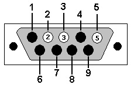

# Met One Instruments Aerocet 531s RS232 Communication Module

This is a python2.7 module for the Met One Instruments Aerocet 531s unit. The user manual
this module was written for can be found at:
[http://www.orionesrl.it/manuali/polveri/MET-ONE%20Aerocet%20531s_manual.pdf](http://www.orionesrl.it/manuali/polveri/MET-ONE%20Aerocet%20531s_manual.pdf)

This module is intended for use on Linux distributions, and has only been tested on Debian based distros using python 2.7.

## Getting Started

The Met One Instruments Aerocet 531s is a handheld particle counter that measures particle counts of fixed sizes. The Aerocet 531s communicates via two methods: USB port and RS232 serial port. This python module focuses on the RS232 serial communication and how to read/write data to the device.

## Prerequisites

### Materials

* RS232 to USB Adapter (Modified, see below)

### Hardware

The Aerocet 531s requires a proprietary RS232 serial cable that can be purchased from Met One Instruments. However, a standard male DB9 connector can be modified to work with the Aerocet. The following modifications must be made:
* Remove all male header pins except for pins 2(RX), 3(TX), 5(GND)



### Software

Clone this repository using HTTPS(or download the .zip file)

```
git clone https://github.com/HarshavardhanAnne/Met-One-Aerocet-531s-serial.git
```

Install the python2.7 serial library

```
sudo apt-get install python-serial
```

Navigate to the cloned directory and copy aerocet531s.py to the project directory you are working in

```
cp aerocet531s.py /path/of/project/
```

## Serial Settings

The Aerocet is configured by default with the following settings:
* Baudrate: 38400
* Data Bits: 8
* Parity: None
* Stop Bits: 1
* Flow Control: None

You can change the baudrate through the settings menu on the device. The instructions are found in section 5 of the manual linked above.
The following baudrates are available:
```
300,600,1200,2400,4800,9600,14400,19200,38400
```

## How to Use

To use this module, the following inputs are required when creating an instance of this class:
* BAUDRATE: Baudrate for communication. Must match the baudrate on the device
* PORT: Linux serial port the unit is connected to, usually '/dev/ttyUSB0'
* PRINT_OPTION (optional): Enables or disables debug print statements (0 = Disabled, 1 = Enabled)

## Example

```
from aerocet531s import Aerocet531s  
aeroObject1 = Aerocet531s(38400,'/dev/ttyUSB0')  
#aeroObject2 = Aerocet531s(38400,'/dev/ttyUSB0',1)  

#Start serial connection to device  
aeroObject1.open()  

#Put the unit into comm mode  
aeroObject1.activate_comm_mode()  

#'SS' command returns the serial number  
results = aeroObject.command('SS')  

#'DYYYY-MM-DD' changes the date  
results = aeroObject.command('D2018-07-11')  

#'T1' changes the temperature units to F  
results = aeroObject.command('T1')  

#Get the current status of the unit  
stat = aeroObject1.get_status()  

#Start the aerocet sampling  
aeroObject1.start_sampling()  

#Stop the aerocet sampling  
aeroObject1.stop_sampling()  

#Close serial connection to device  
aeroObject1.close()  
```

## Notes

* You must call activate_comm_mode() before calling command().
* After calling activate_comm_mode(), the device is put into comm mode for about 30 seconds.
* The commands can be found in the above linked manual.
* THe commands are not case sensitive.
